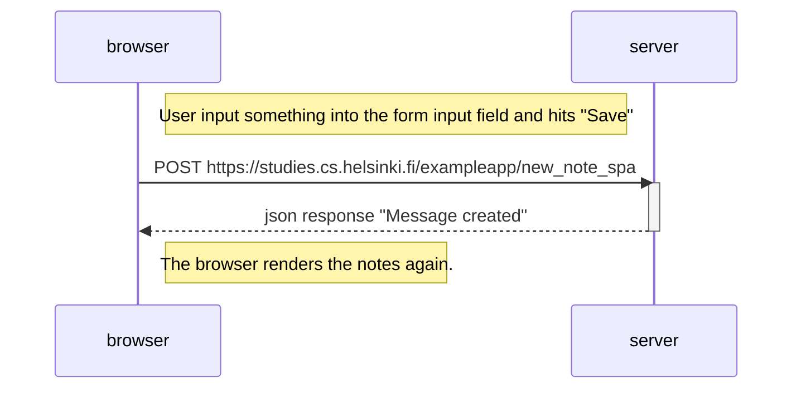

```mermaid
sequenceDiagram
    participant browser
    participant server

    Note right of browser: User input something into the form input field and hits "Save"

    browser->>server: POST https://studies.cs.helsinki.fi/exampleapp/new_note_spa
    activate server
    server-->>browser: json response "Message created"
    deactivate server  

    Note right of browser: The browser renders the notes again.
```